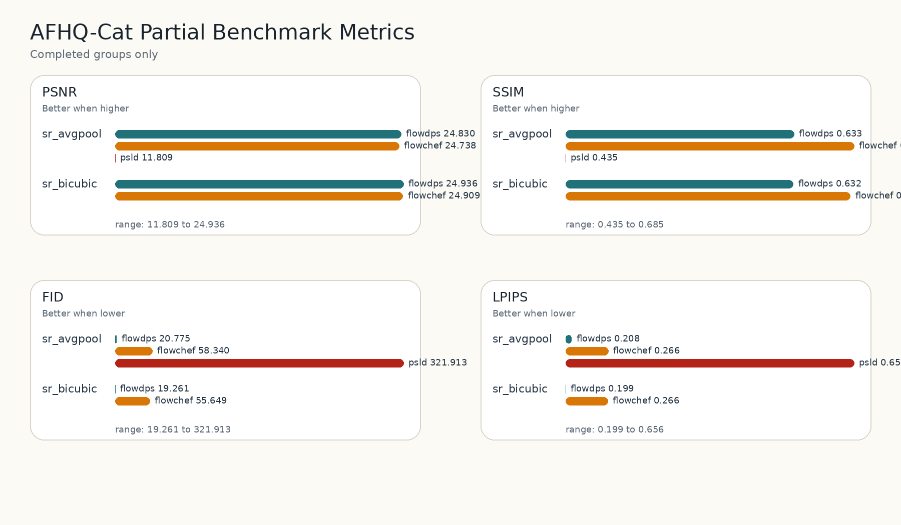
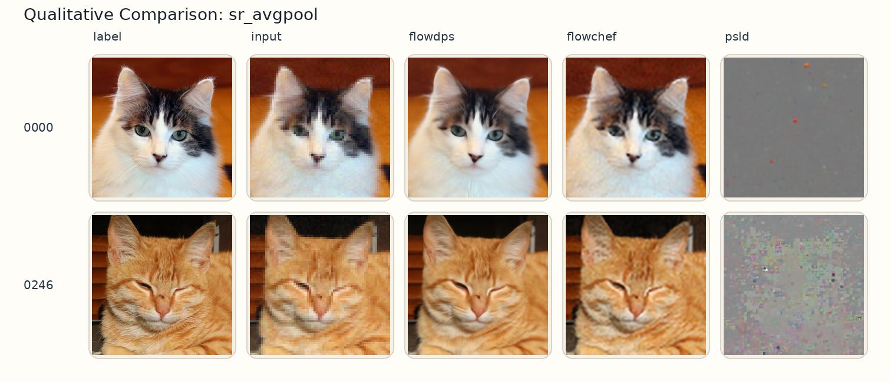
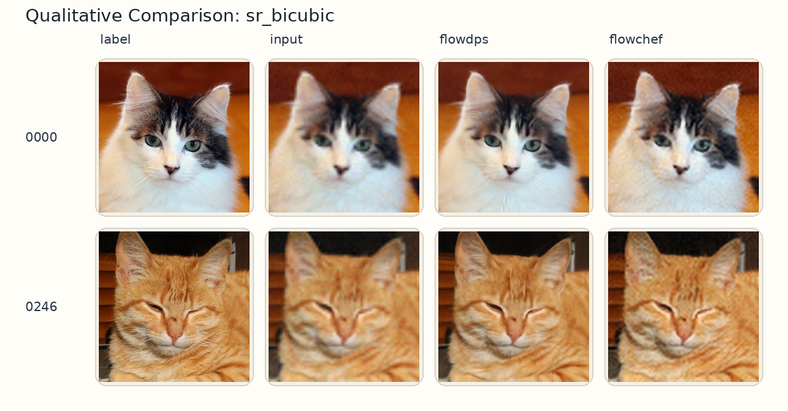

# FlowDPS Reproduction Notes 🌊

This repository collects our reading notes, partial reproduction outputs, and benchmark summaries for **FlowDPS: Flow-Driven Posterior Sampling for Inverse Problems**.

The goal is simple: make the paper's inverse-problem experiments easier to inspect, compare, and resume.



## What This Project Covers

FlowDPS extends diffusion-style posterior sampling into the broader **flow matching / ODE generative modeling** framework. In this repo, we focus on the reproducible benchmark side:

- 🧪 Completed AFHQ-Cat super-resolution benchmark groups
- 📊 Metric tables for FlowDPS, FlowChef, and PSLD
- 🖼️ Qualitative reconstruction comparisons
- 📝 A compact report explaining what has finished and where to resume

This is a **reproduction and analysis package**, not the official FlowDPS code release.

## Current Reproduction Status

| Scope | Progress |
| --- | ---: |
| AFHQ-Cat benchmark groups | `5 / 12` |
| Public benchmark default plan | `5 / 36` |
| Completed tasks | `sr_avgpool`, `sr_bicubic` |
| Compared methods | `flowdps`, `flowchef`, `psld` |

## Quick Metric Snapshot

| Task | Method | PSNR ↑ | SSIM ↑ | FID ↓ | LPIPS ↓ | Runtime |
| --- | --- | ---: | ---: | ---: | ---: | ---: |
| `sr_avgpool` | FlowDPS | **24.830** | 0.6329 | **20.775** | **0.2083** | 3.91 hr |
| `sr_avgpool` | FlowChef | 24.738 | **0.6848** | 58.340 | 0.2665 | **2.21 hr** |
| `sr_avgpool` | PSLD | 11.809 | 0.4346 | 321.913 | 0.6564 | 3.74 hr |
| `sr_bicubic` | FlowDPS | **24.936** | 0.6322 | **19.261** | **0.1989** | 4.67 hr |
| `sr_bicubic` | FlowChef | 24.909 | **0.6816** | 55.649 | 0.2658 | **2.11 hr** |

## Visual Comparisons

| Super-resolution task | Qualitative output |
| --- | --- |
| Avg-pool x12 |  |
| Bicubic x12 |  |

## Repository Map

```text
.
├── Flowdps- Flow-driven posterior sampling for inverse problems.pdf
├── README.md
└── deliverables/
    └── afhq_cat_partial_reproduction_2026-04-18/
        ├── README.md
        ├── docs/       # detailed partial reproduction report
        ├── figures/    # metric and qualitative figures
        ├── results/    # per-run metadata
        └── tables/     # clean CSV summaries
```

## How To Read This Repo

1. Start with [`deliverables/afhq_cat_partial_reproduction_2026-04-18/README.md`](deliverables/afhq_cat_partial_reproduction_2026-04-18/README.md) for the reproduction scope.
2. Open [`docs/afhq_cat_partial_report.md`](deliverables/afhq_cat_partial_reproduction_2026-04-18/docs/afhq_cat_partial_report.md) for metric explanations and figures.
3. Use [`tables/afhq_cat_completed_only.csv`](deliverables/afhq_cat_partial_reproduction_2026-04-18/tables/afhq_cat_completed_only.csv) if you want to re-plot or compare the completed runs.
4. Check the [paper PDF](<Flowdps- Flow-driven posterior sampling for inverse problems.pdf>) for the original method background.

## Resume Point

The benchmark was paused after:

- `afhq_cat / sr_avgpool / flowchef`
- `afhq_cat / sr_avgpool / flowdps`
- `afhq_cat / sr_avgpool / psld`
- `afhq_cat / sr_bicubic / flowchef`
- `afhq_cat / sr_bicubic / flowdps`

The next unfinished AFHQ-Cat groups begin with:

- `sr_bicubic / psld`
- `deblur_gauss / flowdps`
- `deblur_gauss / flowchef`
- `deblur_gauss / psld`
- `deblur_motion / flowdps`
- `deblur_motion / flowchef`
- `deblur_motion / psld`

## Takeaway

Across the completed AFHQ-Cat runs, FlowDPS gives the strongest reconstruction quality on PSNR, FID, and LPIPS, while FlowChef is faster and often has higher SSIM. That trade-off is the main story captured by this package.
